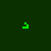
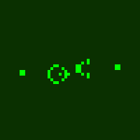

# termlife

A terminal-based Game of Life implementation in Go. Single binary, zero config, just works.





## Installation

### macOS

```bash
brew install ticktockbent/tap/termlife
```

### Linux (Debian/Ubuntu)

```bash
# Download the .deb from the latest release
curl -LO https://github.com/ticktockbent/termlife/releases/latest/download/termlife_linux_amd64.deb
sudo dpkg -i termlife_linux_amd64.deb
```

### Linux (Fedora/RHEL)

```bash
# Download the .rpm from the latest release
curl -LO https://github.com/ticktockbent/termlife/releases/latest/download/termlife_linux_amd64.rpm
sudo rpm -i termlife_linux_amd64.rpm
```

### Windows

Download `termlife_<version>_windows_amd64.zip` from the [Releases](https://github.com/ticktockbent/termlife/releases) page, extract, and add to your PATH.

### Via Go (any platform)

```bash
go install github.com/ticktockbent/termlife@latest
```

## Usage

```bash
# Run with defaults (random grid, Conway rules, auto-sized to terminal)
termlife

# Specify a preset pattern
termlife --pattern glider
termlife --pattern gosper-gun

# Customize appearance
termlife --color matrix
termlife --color amber
termlife --fps 15

# Alternate rulesets
termlife --rule "B36/S23"    # HighLife
termlife --rule "B3/S12345"  # Maze

# Grid options
termlife --size 80x40        # explicit dimensions
termlife --wrap              # toroidal wrapping (edges connect)
termlife --density 0.35      # initial fill density for random patterns

# Combine options
termlife --pattern pulsar --color cyan --fps 10 --wrap
```

## GIF Export

Export animations as GIF files for sharing:

```bash
# Basic usage
termlife --gif 25 --pattern glider --size 15x15

# Custom output and scale
termlife --gif 100 --pattern gosper-gun --size 80x40 --gif-scale 4 --gif-out gosper.gif

# With color themes
termlife --gif 50 --pattern r-pentomino --size 60x60 --color rainbow
```

## CLI Reference

| Flag | Default | Description |
|------|---------|-------------|
| `--pattern` | `random` | Initial pattern: `random`, `glider`, `blinker`, `toad`, `beacon`, `pulsar`, `gosper-gun`, `diehard`, `acorn`, `r-pentomino`, `lwss`, `block`, `beehive`, `loaf`, `pentadecathlon` |
| `--rule` | `B3/S23` | Birth/survival rule string |
| `--color` | `white` | Color theme: `white`, `green`, `matrix`, `amber`, `cyan`, `rainbow` |
| `--fps` | `10` | Frames per second (1-60) |
| `--size` | auto | Grid dimensions as `WxH`; defaults to terminal size and follows resizes |
| `--wrap` | `false` | Enable toroidal wrapping |
| `--density` | `0.25` | Cell density for random initialization (0.0-1.0) |
| `--gif` | - | Number of frames to render (enables GIF mode) |
| `--gif-out` | `termlife.gif` | Output file path for GIF |
| `--gif-scale` | `4` | Pixels per cell in GIF output |
| `--gif-delay` | `100` | Milliseconds between GIF frames |
| `--gif-loop` | `0` | Number of times to loop GIF (0 = infinite) |
| `--help` | | Show help |
| `--version` | | Show version |

## Interactive Controls

| Key | Action |
|-----|--------|
| `q` / `Esc` / `Ctrl+C` | Quit |
| `Space` | Pause/resume |
| `n` | Step one generation (when paused) |
| `r` | Randomize grid |
| `c` | Clear grid |
| `+` / `=` | Increase speed |
| `-` | Decrease speed |
| `Arrow keys` | Move cursor (when paused) |
| `Enter` | Toggle cell at cursor (when paused) |
| Left click / drag | Draw live cells (paused or running) |
| Right click / drag | Erase cells |

## Color Themes

| Theme | Description |
|-------|-------------|
| `white` | White on black (default, high contrast) |
| `green` | Classic green terminal |
| `matrix` | Bright green with dark green background |
| `amber` | Orange CRT nostalgia |
| `cyan` | Cool cyan/blue tones |
| `rainbow` | Cells change color based on age |

## Rule Notation

Standard B/S (Birth/Survival) notation:

- `B3/S23` - Conway's Game of Life (birth on 3 neighbors, survive on 2-3)
- `B36/S23` - HighLife (adds birth on 6)
- `B3/S12345` - Maze
- `B1357/S1357` - Replicator
- `B2/S` - Seeds

## License

MIT
